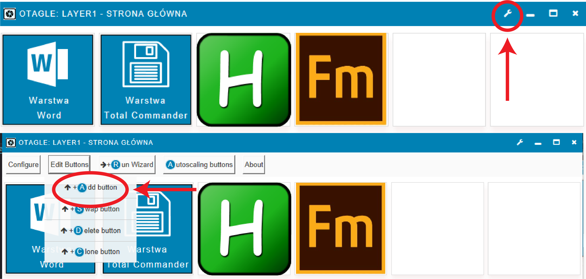

# Otagle
Otagle was inspaired by Elgato stream deck. It's still growing project that allow to customize your environmet with buttons and autohotkey scripts.
The newest version is an Otagle3 with rebuild interface and scaling window so you can adjust it to your needs. 

### How it works?
Otage is a script based on tools provided by Neutron.ahk (https://github.com/G33kDude/Neutron.ahk). 

Every script that will be read by Otagle must be a function, with the same name as file and skipped AHK introduction lines.

### How to setup?
*  after downloading script move file ConfigBuilder.ahk to main folder,
*  start the ConfigBuilder.ahk and chose key size width and height, 
*  then do actions: calculate, test and save config in this order, here you can also add layer name,
*  ConfigBuilder.ahk will create two files - ButtonFunctions.ahk and Config.ini. To work this files must be in main folder of the script.
### How to use?
* After you setup your first layers, run the Otagle3 script (either Flow version, which is made to better work with World layers or basic Otagle3 version) in the right corner you will find the wrench icon. Here you can edit your buttons (add, swap, remove), you can configurate layers and chose monitor you wish Otagle to open.

* Creating button: chosse add button option, you will recive 3 message boxes which will ask you to select SVG picture for your button (format SVG makes scaling possible), AutoHotkey script that will be asign to it and lastly the location in Otagle widnow for your button.
* Now you need to manualy assign your script to ButtonFunctions.ahk file. For example: #Include *i Layer1\RunOrActivate_FrameMaker.ahk. Also is recommend to organise your script layers into subfolders.
### Additional information
* How to quicly check if script works before assiging it to button? - In your script add the introduction lines from AHK script and repeat the function calling line, for example:
  
                #NoEnv

                #SingleInstance, Force

                SendMode, Input

                SetBatchLines, -1

                SetWorkingDir, %A_ScriptDir%

                RunOrActivate_FrameMaker()
  