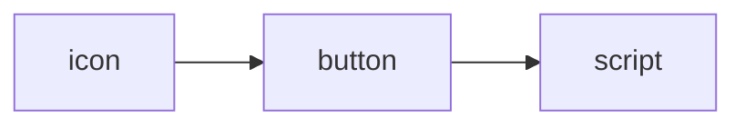
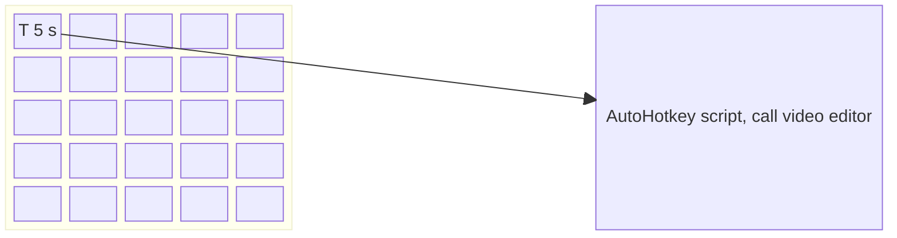
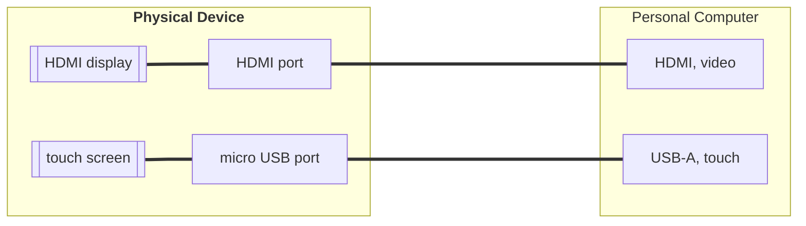

# Otagle, introduction
Otagle is inspaired by commercial product [Elgato stream deck](https://www.elgato.com/us/en/s/welcome-to-stream-deck). Once upon a time I decided to make something similar with fraction of a cost. The name of my software framework, *Otagle* is actually anagram to word *Elgato*; the word *otagle* is formed by reading the word *elgato* backwards.

The idea behind is simple: configurable tool, where you can easily connect any icon to any button and to any script.

At the moment it works only with Microsoft Windows operating systems (10 and 11) and is based on [AutoHotkey](https://www.autohotkey.com/docs/AutoHotkey.htm) scripting language.

## Example

For example you would like to have some shortcuts, visually appealing, to call your favorite function in video editor. So instead of clicking over menu and submenu and drop-down-list, you would like to directly specify 5 s, as your scene outro by default takes 5 s. So you select icon **T [5 s]**, connect it with top-right button and connect it to an AutoHotkey script, which calls API (Application Programming Interface) of your video editor. This principle can be translates into the following matrix: 

The matrix of icons / buttons can have pure software form, e.g. as a separate Otagle application window, but it makes much more sense to make it over more touchable, tactile piece of hardware, a *Physical Device*. To follow this challenge I found cheap, small touch screens, which can be interfaced to a computer over: 
- two USB-A wires (the 1st to connect video signal, the 2nd to connect touch screen feedback)
- one HDMI wire (to connect video signal) and one USB-A wire (to connect touch screen feedback)

Hardware example:

Some parameters:
- display size: 7'' =  1024 pixels x 600 pixels TFT (Thin Film Transistor)

## Existing versions of code

- **Otagle1**, non-scallable window, 1024 x 600 px, replaces numeric keypad (numpad)
- **Otagle2**, 
- **Otagle3**,

For details please see dedicated folders and readme.md files.

