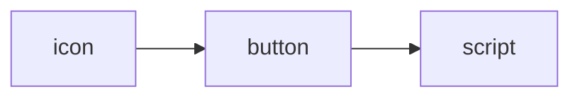
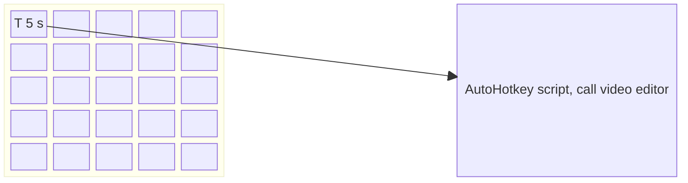
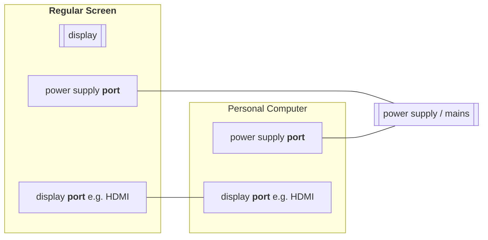
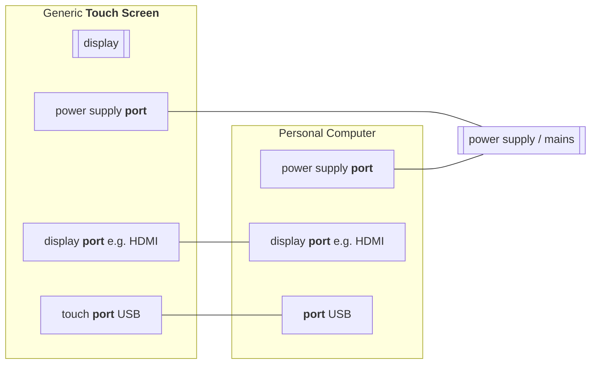
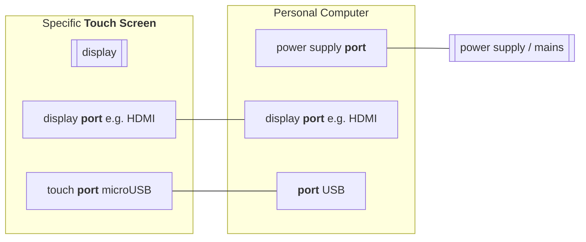
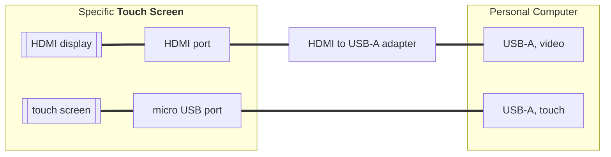
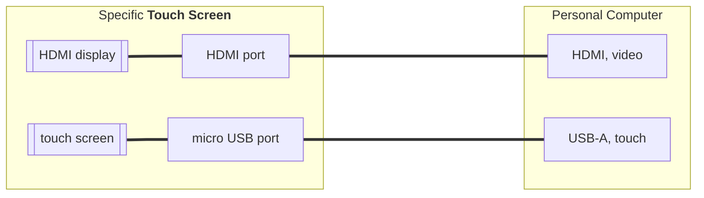

# Otagle, introduction
Otagle is inspaired by commercial product [Elgato stream deck](https://www.elgato.com/us/en/s/welcome-to-stream-deck). Once upon a time I decided to make something similar with fraction of a cost. The name of my software framework, *Otagle* is actually anagram to word *Elgato*; the word *otagle* is formed by reading the word *elgato* backwards.

https://youtu.be/5zKbTOXBqEs

[Watch the video](https://youtu.be/5zKbTOXBqEs)

The idea behind is simple: configurable tool, where you can easily connect any icon to any button and to any script.

At the moment it works only with Microsoft Windows operating systems (10 and 11) and is based on [AutoHotkey](https://www.autohotkey.com/docs/AutoHotkey.htm) scripting language.

## Example

For example you would like to have some shortcuts, visually appealing, to call your favorite function in video editor. So instead of clicking over menu and submenu and drop-down-list, you would like to directly specify 5 s, as your scene outro by default takes 5 s. So you select icon **T [5 s]**, connect it with top-right button and connect it to an AutoHotkey script, which calls API (Application Programming Interface) of your video editor. This principle can be translates into the following matrix: 

The matrix of icons / buttons can have pure software form, e.g. as a separate Otagle application window, but it makes much more sense to make it over more touchable, tactile piece of hardware, a *Physical Device* aka touch screen. To follow this challenge I found cheap, small touch screens, which can be interfaced to a computer over: 
- **recommended**: one HDMI wire (to connect video signal) and one USB-A wire (to connect touch screen feedback)
- **optional**: two USB-A wires (the 1st to connect video signal, the 2nd to connect touch screen feedback)

---

##### Picture 1. Comparison between classical screen (display) and specific touch screen.

---

##### Picture 2. Comparison of recommended and optional connection between a **Physical Device** and Personal Computer (PC).

Hardware example:

Some parameters:
- display size: 7''
- display size [pixels]: 1024 x 600
- display active size [cm]: 15.5 x 8.6
- display passive size [cm]: 16.5 x 9.9
- display type: TFT (Thin Film Transistor)
- screen size [cm]: 18 x 12.5

#### Hardware configuration.
In order to run this touch screen both cables must be connected (HDMI and USB). Power is delivered from computer to the touch screen over USB cable, which is also used to 

The HDMI cable could be connected directly to HDMI port or at first to the HDMI to USB adapter. Such adapter is fully plug-and-play, doesn't require any configuration. The one presented at picture above actually stopped working out of sudden, so I don't recommend it.

Configuration of additional display in Microsoft Windows is available in *System* settings:
- menu *Start* → Configuration

- or press keyboard shortcut **# + I** (keyboard chord: Windows key and I) in *System* settings → *Display*.

Information regarding actual touch screen activity are transfered over USB port. From operating system point of view this is just another input device. The issue is it must be logically connected to the correct screen.

Run system application *Calibrate the screen for pen or touch input* aka *Tablet PC Settings* (you can search for it) and configure relation between correct screen and touch.

You're done.

By the way, there are available touch overlays to regular screens of specific size. Such overlays are usually glued (by adhesive tape) or clamped to regular size monitors (e.g. 24''). Thanks to that one can get access to huge button matrix if switching between layers is somehow cumbersome or unwanted.

## Existing versions of Otagle scripts

- [**Otagle1**](https://github.com/mslonik/Otagle/tree/master/Otagle1/README.md), non-scallable window, 1024 x 600 px, replaces numeric keypad (numpad)
- [**Otagle2**](https://github.com/mslonik/Otagle/tree/master/Otagle2/README.md), non-scalleble window of any size, with rectangular buttons, 
- **Otagle3**.

For details please see dedicated folders and readme.md files.

## Additional links

AutoHotkey forum [topic dedicated to Otagle](https://www.autohotkey.com/boards/viewtopic.php?t=69690)